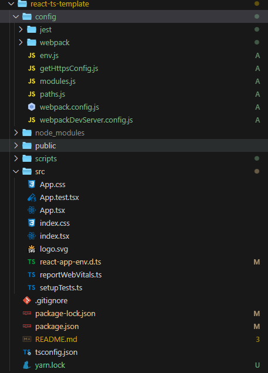

# 创建

## 使用 cra 创建一个 react+ts 项目

npx create-react-app react-app --template typescript

## 添加 eject

eject 使用是因为如果需要使用 less（cra 脚手架中默认使用 sass）或其他配置路径等需要修改时，则需要手动修改 webpack 的配置。这个时候就可以用到 eject。
PS: 它是单项操作当 npm/yarn run eject 时无法还原。所以如需配置 eject 在项目创建时执行。

配置完成后发现项目中的变化


### package.json

#### script

eject 操作后，eject 命令消失（不可逆操作）
不再使用 react-script 封装的插件执行命令，直接基于 node 执行对应的入口文件

#### dependency

eject 之后，会把 webpack 打包需要的所有模块都重新安装一遍，放在依赖项中。

-   babel-preset-react-app:对原来的@babel/preset-env 语法包的重写，目的将 ES6 转换为 ES5 语法，识别 react 语法，实现代码转换。

### jest

打包测试

### webpackDevServer.config.js

webpack-dev-server(启动本地服务插件)的相关配置

### webpack.config.js

脚手架默认的 webpack 打包的相关配置

### paths.js

打包中需要的一些路径管理

### env.js

环境变量的处理

## 添加 less 预编译

需要在 react-app-env.d.ts 文件中添加

```js
declare module "*.less" {
  const less: any;
  export default less;
}
```

同时修改 config 文件夹下面的 webpack.config.js 文件内增加 less 配置或将所有 sass 配置改为 less 配置也可以
可在 webpack.config.js 搜 less-start 和 less-end 为新增 less 配置项

## 添加项目基础配置

-   绝对路径@
    -   config 文件夹下的 webpack.config 内 搜索 alias，在对象内配置一行 `'@': path.resolve('src'),`
    -   在 根目录的 tsconfig.json 内 compilerOptions 对象内配置一行 `"paths": { "@/*": ["./src/*"] }`

## antd+tailwindcss

安装 antdui 框架以及使用 tailwindcss

-   yarn add antd @ant-design/icons tailwindcss
-   创建 tailwind.config.js 配置文件
-   引入 tailwind 功能模块

    ```css
    @tailwind base;
    @tailwind components;
    @tailwind utilities;
    ```

    -   全局使用 antd 的 CSS 变量
        -   引入 ConfigProvider 组件添加cssVar:true
            ```js
            theme={{
                      cssVar: true,
                  }}
            ```

## react-router-dom

## 项目结构划分

### src 目录改造

- pages：路由页面
- components：页面通用组件
  - layout：项目页面layout
  - sider-menu：左侧菜单栏
- utils：公共工具
- router：路由配置


### 字段含义
name: String, 歌曲标题
id: u64, 歌曲ID
pst: 0，功能未知
t: enum,
  0: 一般类型
  1: 通过云盘上传的音乐，网易云不存在公开对应
    如果没有权限将不可用，除了歌曲长度以外大部分信息都为null。
    可以通过 `/api/v1/playlist/manipulate/tracks` 接口添加到播放列表。
    如果添加到“我喜欢的音乐”，则仅自己可见，除了长度以外各种信息均为未知，且无法播放。
    如果添加到一般播放列表，虽然返回code 200，但是并没有效果。
    网页端打开会看到404画面。
    属于这种歌曲的例子: https://music.163.com/song/1345937107
  2: 通过云盘上传的音乐，网易云存在公开对应
    如果没有权限则只能看到信息，但无法直接获取到文件。
    可以通过 `/api/v1/playlist/manipulate/tracks` 接口添加到播放列表。
    如果添加到“我喜欢的音乐”，则仅自己可见，且无法播放。
    如果添加到一般播放列表，则自己会看到显示“云盘文件”，且云盘会多出其对应的网易云公开歌曲。其他人看到的是其对应的网易云公开歌曲。
    网页端打开会看到404画面。
    属于这种歌曲的例子: https://music.163.com/song/435005015
ar: Vec<Artist>, 歌手列表
alia: Vec<String>,
  别名列表，第一个别名会被显示作副标题
  例子: https://music.163.com/song/536623501
pop: 小数，常取[0.0, 100.0]中离散的几个数值, 表示歌曲热度
st: 0: 功能未知
rt: Option<String>, None、空白字串、或者类似`600902000007902089`的字符串，功能未知
fee: enum,
  0: 免费或无版权
  1: VIP 歌曲
  4: 购买专辑
  8: 非会员可免费播放低音质，会员可播放高音质及下载
  fee 为 1 或 8 的歌曲均可单独购买 2 元单曲
v: u64, 常为[1, ?]任意数字, 代表歌曲当前信息版本
version: u64, 常为[1, ?]任意数字, 代表歌曲当前信息版本
crbt: Option<String>, None或字符串表示的十六进制，功能未知
cf: Option<String>, 空白字串或者None，功能未知
al: Album, 专辑，如果是DJ节目(dj_type != 0)或者无专辑信息(single == 1)，则专辑id为0
dt: u64, 歌曲时长
hr: Option<Quality>, Hi-Res质量文件信息
sq: Option<Quality>, 无损质量文件信息
h: Option<Quality>, 高质量文件信息
m: Option<Quality>, 中质量文件信息
l: Option<Quality>, 低质量文件信息
a: Option<未知>, 常为None, 功能未知
cd: Option<String>, None或如"04", "1/2", "3", "null"的字符串，表示歌曲属于专辑中第几张CD，对应音频文件的Tag
no: u32, 表示歌曲属于CD中第几曲，0表示没有这个字段，对应音频文件的Tag
rtUrl: Option<String(?)>, 常为None, 功能未知
rtUrls: Vec<String(?)>, 常为空列表, 功能未知
djId: u64,
  0: 不是DJ节目
  其他：是DJ节目，表示DJ ID
copyright: u32, 0, 1, 2: 功能未知
s_id: u64, 对于t == 2的歌曲，表示匹配到的公开版本歌曲ID
mark: u64, 功能未知
originCoverType: enum
  0: 未知
  1: 原曲
  2: 翻唱
originSongSimpleData: Option<SongSimpleData>, 对于翻唱曲，可选提供原曲简单格式的信息
single: enum,
  0: 有专辑信息或者是DJ节目
  1: 未知专辑
noCopyrightRcmd: Option<NoCopyrightRcmd>, 不能判断出歌曲有无版权
mv: u64, 非零表示有MV ID
rtype: 常为0，功能未知
rurl: Option<String(?)>, 常为None，功能未知
mst: u32, 偶尔为0, 常为9，功能未知
cp: u64, 功能未知
publishTime: i64, 毫秒为单位的Unix时间戳
pc: 云盘歌曲信息，如果不存在该字段，则为非云盘歌曲